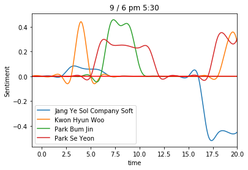
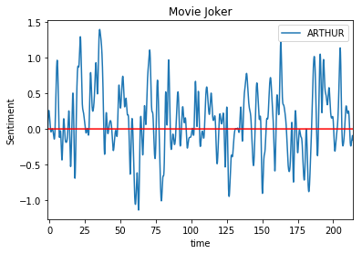
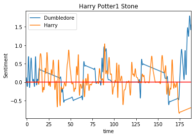
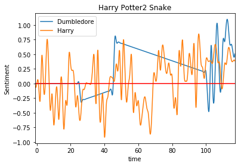

# Converstaion Sentimental Analysis 📽

감정은 크게 긍정(pos)과 부정(neg)으로 나눌 수 있습니다.
** 😥 -1  ~ 1 😁**

많은 사람들이 대화를 하는 카톡에서 대화의 감정을 파악하면 전체적인 대화의 흐름을 파악할 수 있으므로
눈치없는 사람들에게 큰 도움이 되겠죠? 

이런 아이디어에서 대화를 시각화하는 작업을 했습니다.

* Python
* Vader
* Matplot

## 1. Kakaotalk NLP 📱
대화에 참여한 인물들에 대하여 각 메세지별로 감성점수를 매겨서 전체적인 흐름을 나타내겠습니다.

|| 
|:--:| 
| 감정 흐름 그래프 |
부정적인 부분도 있고, 긍정적인 부분도 있습니다. 
지금 대화는 단편적으로 나타난 것이지만
이를 더 큰 대화에 적용한다면 그 사람의 특징으로 생각할 수 있습니다.

## 2. Application 🎬

대화는 개인정보 활용에 대한 민감한 사항이 있으므로 영화를 가지고 
감정분석을 해보겠습니다.

* Joker 
* Harry Potter 1
* Harry Potter 2

> 영화 조커

|| 
|:--:| 
| Joker |

조커는 꽤나 복잡한 감정선을 가지고 있습니다. 감정의 진폭이 상당히 크군요.

그러나 이건 사실이 아닙니다. 그래프의 범례를 보시면 AUTHER 라고 적혀있는 것을 확인 할 수 있는데요.

이 영화에서 주인공 AUTHER 는 일반인으로 그가 JOKER 가 된 후에는 

영화에서 따로 **JOKER** 라고 명칭을 바꿉니다. 

그러니까 저 감정선은 조커가 되기 전에 불안한 인간의 심리를 나타낸다고 해석할 수 있습니다.

---

> 영화 해리포터

|| | 
|:--:|:--:| 
| Harry Potter 1 | Harry Potter 2 |

해리포터 감정 분석에서 신기한 점은 덤블도어 교수님이 항상 마지막에 나타나서 긍정적인 말을 한다는 것입니다. 

이는 영화의 특징을 잘 나타내는 것으로 항상 해리가 고통 받다가 마지막에 해피앤딩으로 끝나는 

대부분의 해리포터 시리즈를 잘 나타내는 것 같습니다. 

---

영화의 종류는 다양하기 때문에 모든 경우에 대해서 해보지 않았지만, 영화의 감정을 분석한다는 것은 

영화의 또다른 특징을 뽑는 것과 유사한 것 같습니다. 

그럼 이렇게 뽑은 특징을 활용한다면 어떨까요?

-끝 - 

